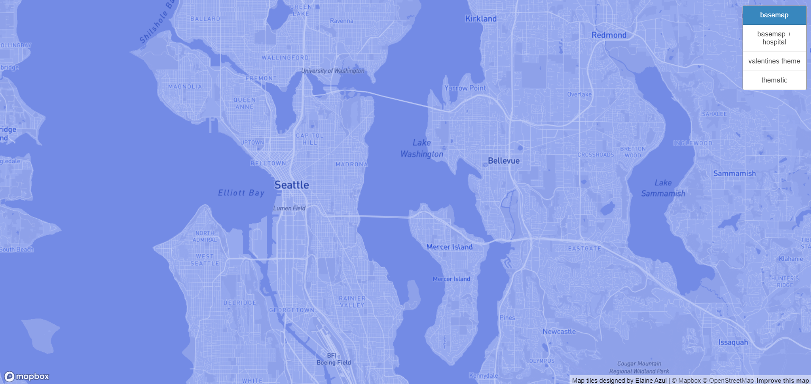
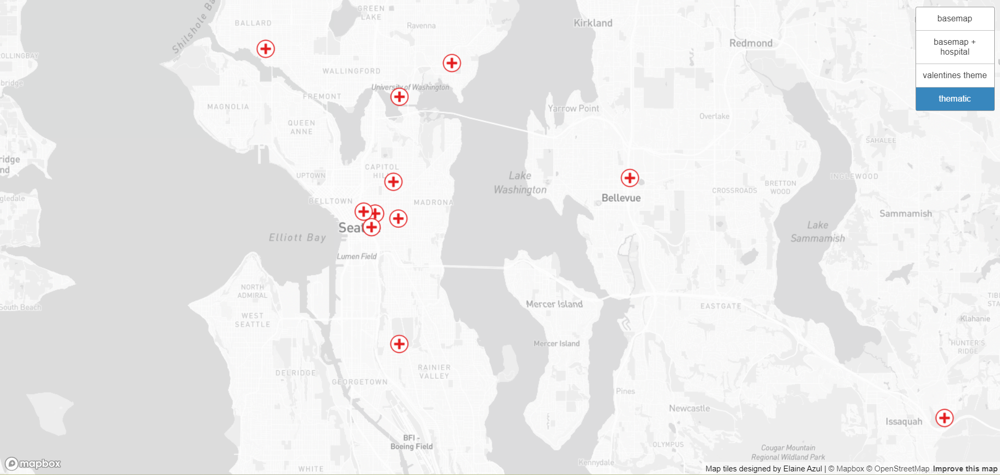
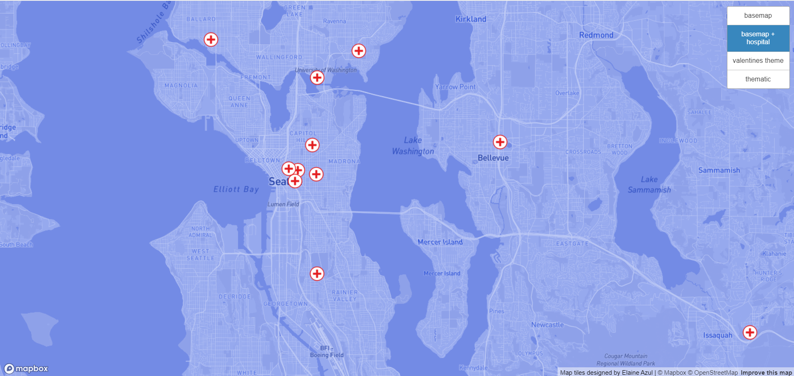
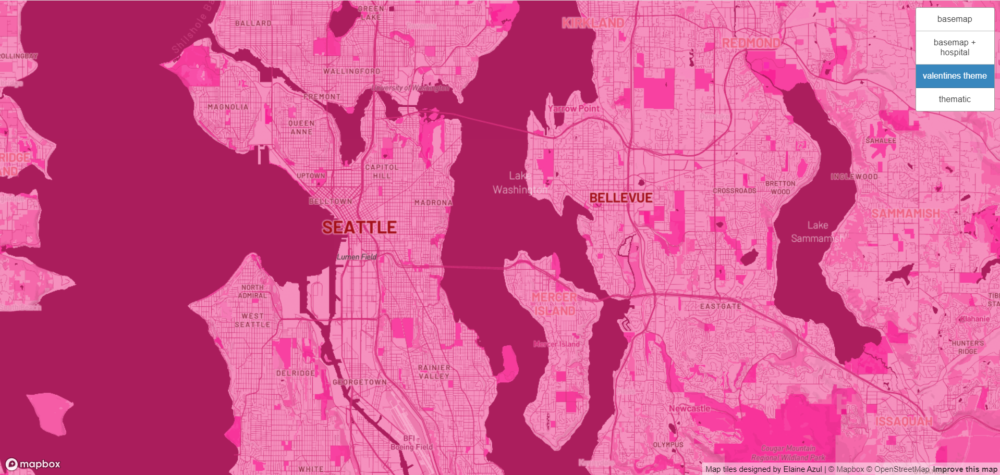

# Map Design and Tile Generation
Link to web map: [https://eazebra.github.io/lab4-458/](https://eazebra.github.io/lab4-458/)

## Tile 1

Description of Tile: Modified basemap in monochromatic blue tones that enhance city names and roads.

Examined Geographic Area: Seattle Washington metropolitan area

Zoom Levels: Max Zoom - 14; Min Zoom - 3

## Tile 2

Description of Tile: Thematic layer of Hospitals in Seattle area

Examined Geographic Area: Seattle Washington metropolitan area

Zoom Levels: Max Zoom - 14; Min Zoom - 3

## Tile 3

Description of Tile: Thematic layer of hospitals plotted on modified basemap

Examined Geographic Area: Seattle Washington metropolitan area

Zoom Levels: Max Zoom - 14; Min Zoom - 3

## Tile 4

Description of Tile: Valentines themed map in valentines day color scheme

Examined Geographic Area: Seattle Washington metropolitan area

Zoom Levels: Max Zoom - 14; Min Zoom - 3

